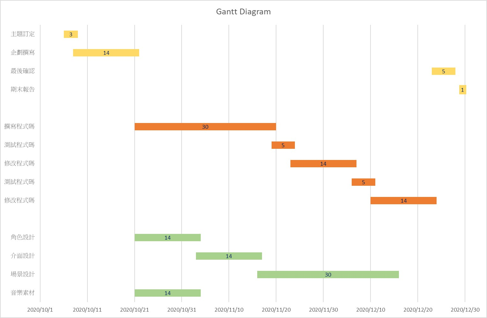
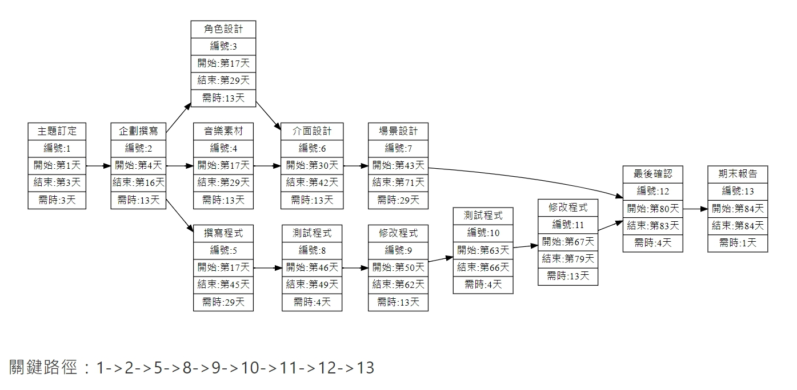
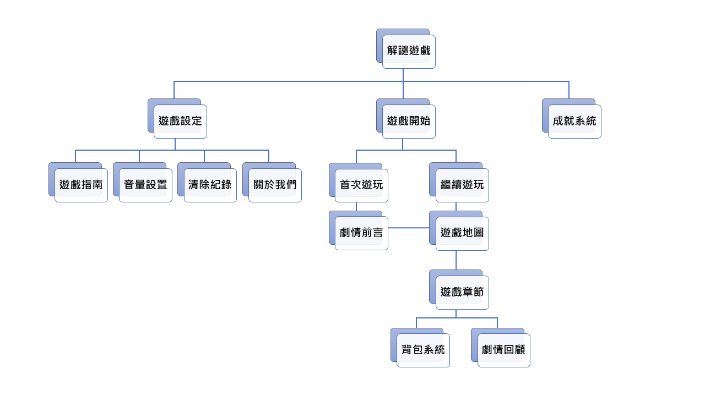
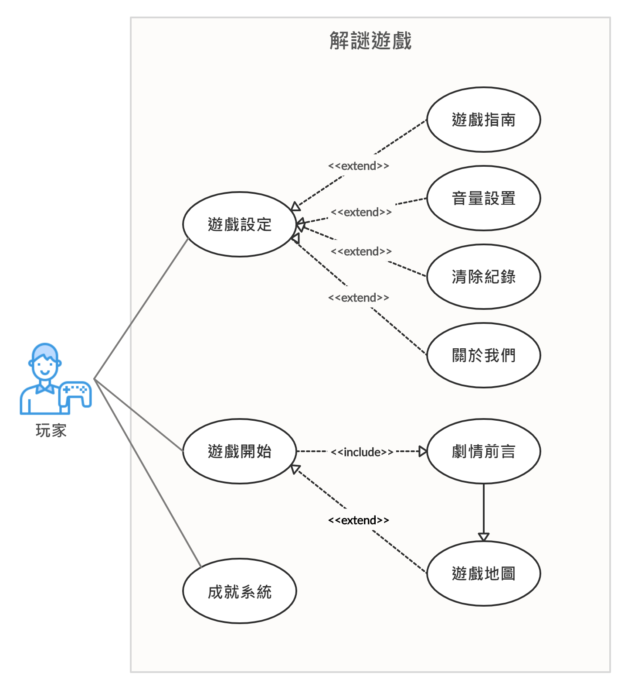
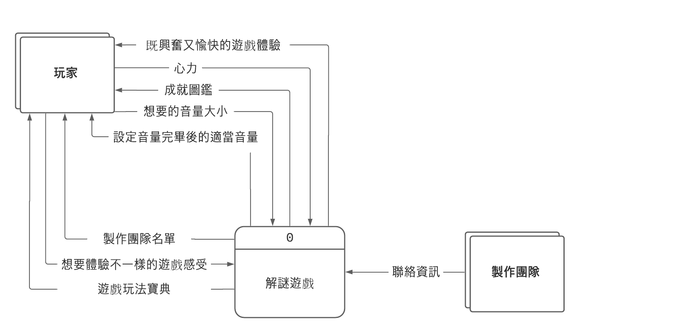
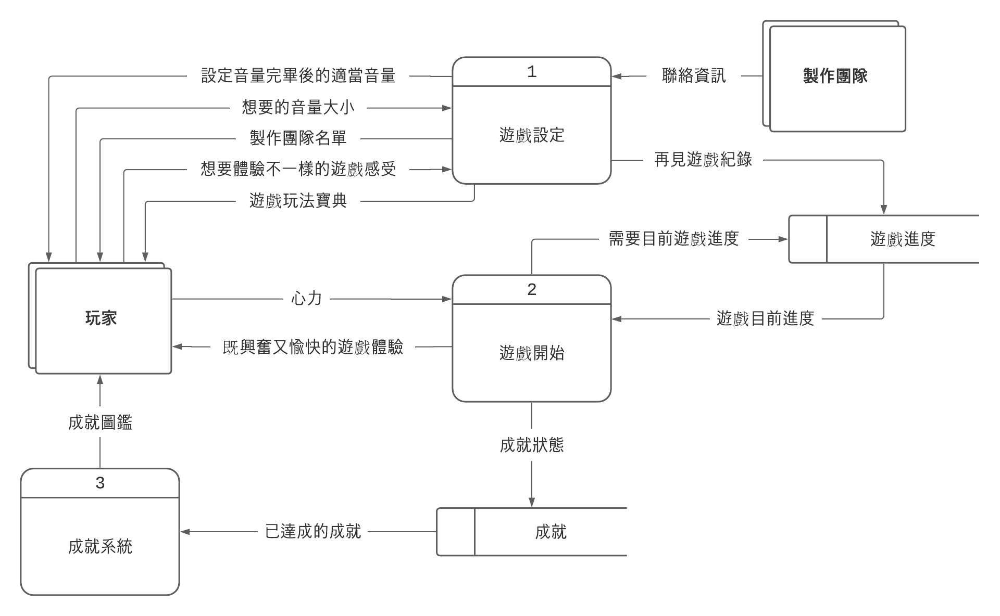

# SA_Group11
## 專題題目：Unity解謎遊戲
| | 小組成員 | 團隊分工 |
| :-----:| :-----:| :-----:|
|組員| C107118121 盧怡璇|美術|
|組員| C107118128 黃薇倩|企劃|
|組長| C107118150 梁家菁|程式|
### 內容
##### 採取解謎的方式進行遊戲，原創性的故事帶玩家深入其境。
##### 目的是讓玩家思考劇情所帶來的意涵。
***
### 甘特圖

***
### PERT/CPM

### 功能性需求
1. 觀看劇情
2. 撿取道具
3. 謎題關卡

### 非功能性需求
1. 維護性：程式的命名規則相同，建立日誌紀錄系統。
2. 反應時間：使用者所觸發之事件的執行時間控制在1秒內。
3. 使用性：使用者介面清楚明瞭、易於操作。
4. 可靠度：預測系統可能發生的錯誤，並提前制定解決方案，以確保在系統發生錯誤時，能持續運作。
5. 效能：控制頁面資訊量，避免因資訊量過大而導致加載時間長。例如：遊戲中圖片、影片或3D模型的檔案大小維持在高品質且低耗能。

### 功能分解圖(functional decomposition diagram, FDD)

### 需求分析的文字描述
1. 玩家可以藉由遊戲設定來瞭解遊戲遊玩方法
2. 玩家可以藉由遊戲設定來調整音量
3. 玩家可以藉由遊戲設定來清除紀錄
4. 玩家可以藉由遊戲設定來得知製作者資訊
5. 假如玩家首次遊玩，將會進入劇情前言
6. 首次遊玩玩家在觀看完劇情前言後，將會進入遊戲地圖
7. 假如玩家非首次遊玩，將會進入遊戲地圖
8. 玩家在遊戲地圖可進入遊戲章節
9. 玩家可以在成就系統查看已完成的成就

### 使用案例圖

### 使用案例說明
|使用案例名稱|遊戲設定|
|:------|:----------|
|行動者|玩家|
|說明|描述遊戲設定過程|
|完成動作|1. 玩家瞭解遊玩方法 2. 設置最適音量 3. 將記錄清除以便重新遊玩 4. 取得製作者資訊|
|替代方法|1. 玩家瞭解遊玩方法 2. 設置最適音量 3. 無紀錄可清除 4. 取得製作者資訊|
|先決條件|玩家對預設設置有更改的需求|
|後置條件|設定結束，可繼續遊玩|
|假設|無|

|使用案例名稱|遊戲開始|
|:------|:----------|
|行動者|玩家|
|說明|開始進行遊戲的過程|
|完成動作|1. 首次遊玩會先進入劇情前言 2. 非首次遊玩則會進入遊戲地圖|
|替代方法|1. 首次遊玩會先進入劇情前言，玩家選擇跳過劇情 2. 非首次遊玩則會進入遊戲地圖|
|先決條件|玩家想要開始遊戲|
|後置條件|玩家遊玩結束，可以清除紀錄，再次遊玩以體驗不同劇情結果|
|假設|無|

|使用案例名稱|成就系統|
|:------|:----------|
|行動者|玩家|
|說明|檢視已完成的成就|
|完成動作|1. 玩家得知已完成的成就|
|替代方法|1. 玩家未完成成就|
|先決條件|玩家在遊玩過程中達成成就條件|
|後置條件|成就已部分或全部達成|
|假設|無|
---
### 系統環境圖

### 圖0

### UML class Diagram

### 循序圖＆活動圖
#### 使用案例1

#### 使用案例2

#### 使用案例3

